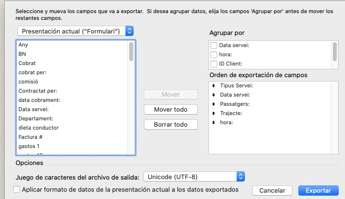

# CSVProcessor
Creates a textfile in the Fomento format, from a CSV file. Automatically adapts and calculates the fields needed in the txt file.

TODO:

Make the text larger
Improve the autocomplete function

In filemaker:
"Valores separados por comas"
